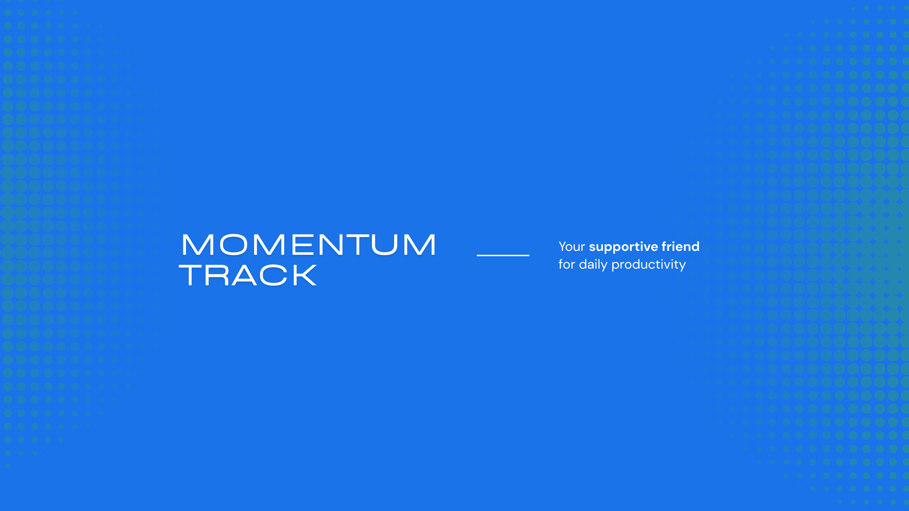

# MomentumTrack 🚀

<div align="center">




*More than a todo list - it's your friend in productivity, discipline, and growth*

[](https://www.python.org/downloads/)
[](https://kivy.org/)
[](https://kivymd.readthedocs.io/)
[](LICENSE)
[](CONTRIBUTING.md)
[](https://github.com/chaudhary-hadi27/MomentumTrack/stargazers)

[Features](#-features) • [Installation](#-installation) • [Usage](#-usage) • [Screenshots](#-screenshots) • [Roadmap](#-roadmap) • [Contributing](#-contributing)

</div>

---

## 🌟 Why MomentumTrack?

Ever felt overwhelmed by endless tasks? Struggling to balance work and life? Need a friend who keeps you motivated and disciplined?

**MomentumTrack is here for you!** 💪

Unlike typical todo apps that just list your tasks, MomentumTrack:

* ✅ **Understands you** - Tracks your habits and adjusts motivational messages
* ⚖️ **Balances your life** - Ensures you're not burning out with 8/8/8 time tracking
* 🎯 **Sees the big picture** - Connects daily tasks to your long-term dreams
* 💬 **Speaks to you** - Encourages when you're low, disciplines when you need it
* 📊 **Shows your growth** - Visualizes your progress with beautiful charts
* 🔔 **Never forgets** - Smart reminders that adapt to your schedule

> **"It's not just an app, it's your companion in becoming the best version of yourself."**

---

## ✨ Features

### 📋 **Smart Task Management**

* ✅ Create unlimited tasks with titles and descriptions
* 🏷️ Organize by categories (Work, Personal, Health, Learning, etc.)
* 🎯 Set priority levels (High, Medium, Low)
* 📅 Add due dates with calendar picker *(coming soon)*
* ✨ Mark as complete with satisfying animations
* 🗑️ Delete tasks easily with confirmation dialogs
* 🔍 Filter by status (Pending, Completed, All)
* 📂 Create project-based task lists
* 🔄 Duplicate recurring tasks
* 📝 Rich text descriptions

### ⏰ **8/8/8 Time Balance Tracker**

The secret to a healthy life: **8 hours work • 8 hours personal • 8 hours sleep**

* 📊 **Interactive pie chart visualization**

  * Real-time color-coded segments
  * Beautiful donut chart design
  * Smooth animations
* 🎚️ **Intuitive sliders**

  * Adjust time with precision (0-16 hours each)
  * See exact values as you slide
  * Instant visual feedback
* 🎯 **Smart balance indicator**

  * 🎉 **Perfect Balance** - You hit 8/8/8!
  * ⚠️ **Almost There** - Close to balance
  * ⏰ **Add More Time** - Under 24 hours
  * ❗ **Over 24 Hours** - Time to reduce
* 💾 **Daily tracking**

  * Save your daily time distribution
  * Auto-load previous day's data
  * Persistent storage
* 📈 **Historical trends** *(coming soon)*

  * Weekly averages
  * Monthly patterns
  * Identify burnout risks

### 🎯 **Long-term Goal Tracking** *(Coming Soon)*

* 🌟 Set meaningful life goals (Career, Health, Relationships, Finance)
* 📊 Break goals into actionable milestones
* 🔗 Link daily tasks to specific goals
* 📈 Track progress percentage with visual bars
* 🎉 Celebrate achievements with animations
* 📅 Review goals regularly (weekly/monthly)
* 💡 Get suggestions to stay on track
* 🏆 Goal completion statistics

### 📊 **Progress Visualization** *(Coming Soon)*

* 📈 Daily completion rate line graphs
* 📊 Weekly productivity bar charts
* 📉 Monthly achievement trends
* 🔥 Streak tracking with fire icons
* 📅 Calendar heatmap view
* 🎯 Goal progress circles
* 📱 Compare performance over time
* 💾 Export reports as PNG/PDF
* 📧 Share achievements via email

### 🔔 **Smart Reminders & Notifications**

* 🔊 Custom notification sounds (8 built-in tones)
* 🔄 Repeating reminders:

  * Daily (every day at specific time)
  * Weekly (specific days)
  * Monthly (specific date)
  * Custom intervals
* 📍 Location-based reminders *(future)*
* ⏰ Time-sensitive alerts
* 💤 Snooze with intelligent rescheduling
* 🌙 Quiet hours support (DND mode)
* 📲 Badge count on app icon
* 🎵 Vibration patterns
* 🔕 Per-task notification settings

### 💪 **Motivational Intelligence**

Your personal cheerleader and coach!

#### **Motivational Mode** 🌟

Get encouraging messages when you need a boost:

* "You're doing great! Keep going! 💪"
* "Small progress is still progress 🚀"
* "Believe in yourself! You've got this! ⭐"
* "Every task completed is a step forward! 🎯"
* "You're building momentum! Don't stop now! 🔥"
* "Proud of you for showing up today! 💙"

#### **Discipline Mode** ⚡

Get firm reminders when you're slacking:

* "Stop procrastinating. Start now! ⏰"
* "No excuses. Time to work! 💼"
* "Focus. Execute. Succeed! 🎯"
* "You said you'd do it. Prove it! 💪"
* "Comfort zone is the enemy of growth! 🚀"
* "Your future self will thank you! ⭐"

#### **Smart Detection** 🧠

* 📊 Tracks your completion rate in real-time
* 🎯 Triggers motivation when < 60% (customizable threshold)
* 📅 Reviews your goals weekly
* 🎉 Celebrates wins with you (confetti animations!)
* 📉 Detects productivity drops and adjusts tone
* 🌅 Morning boost messages
* 🌙 Evening reflection summaries

---

## ⚙️ Installation

### 🧩 Requirements

* Python **3.10+**
* [Kivy](https://kivy.org/doc/stable/gettingstarted/installation.html) `>=2.3.0`
* [KivyMD](https://kivymd.readthedocs.io/en/latest/)
* Pillow (for images)
* Matplotlib (for charts)
* Plyer (for notifications)
* JSON (for data storage)

### 💻 Setup Steps

```bash
# Clone this repository
git clone https://github.com/chaudhary-hadi27/MomentumTrack.git
cd MomentumTrack

# Create a virtual environment
python -m venv env
source env/bin/activate   # For Linux/Mac
# OR
env\Scripts\activate      # For Windows

# Install dependencies
pip install -r requirements.txt

# Run the app
python main.py
```

### 🧾 requirements.txt

```
kivy==2.3.0
kivymd==1.2.0
matplotlib
pillow
plyer
```

---

## 🚀 Usage

### 🏁 Run the App

```bash
python main.py
```

### 🎮 Basic Controls

* 🆕 Add new tasks from the "+" button
* ✅ Tap task to mark complete
* 🗑️ Long press (or hold) to delete a task
* ⚙️ Adjust your 8/8/8 balance in the Time tab
* 💬 Switch between **Motivational** and **Discipline** mode

---

## 🖼️ Screenshots

<div align="center">

| Home Screen                          | Add Task                                | 8/8/8 Tracker                              |
| ------------------------------------ | --------------------------------------- | ------------------------------------------ |
|  |  |  |

| Motivation                                       | Discipline Mode                                  | Statistics                             |
| ------------------------------------------------ | ------------------------------------------------ | -------------------------------------- |
|  |  |  |

</div>

---

## 🧭 Roadmap

| Feature               | Status         |
| --------------------- | -------------- |
| Smart task management | ✅ Done         |
| 8/8/8 time tracker    | ✅ Done         |
| Motivational system   | ✅ Done         |
| Long-term goals       | 🚧 In Progress |
| Productivity charts   | 🚧 In Progress |
| Cloud sync (Firebase) | 🕒 Planned     |
| AI-based suggestions  | 🕒 Planned     |
| Android APK release   | 🕒 Planned     |

---

## 🤝 Contributing

We welcome all contributions!

1. Fork the repo
2. Create your feature branch (`git checkout -b feature/amazing-feature`)
3. Commit your changes (`git commit -m 'Add amazing feature'`)
4. Push to the branch (`git push origin feature/amazing-feature`)
5. Open a Pull Request 🚀

Please follow the [Contributing Guidelines](CONTRIBUTING.md) and maintain consistent code style.

---

## 🧠 Tech Stack

* 🐍 **Python 3.10+** — Core logic
* 🎨 **Kivy** — UI Framework
* 💅 **KivyMD** — Material Design components
* 🔔 **Plyer** — Notifications
* 📊 **Matplotlib** — Data visualization
* 💾 **JSON** — Local data storage

---

## 📜 License

This project is licensed under the **MIT License** — see the [LICENSE](LICENSE) file for details.

---

## 💬 Feedback

We’d love to hear from you!

📧 Email: **[chaudharyhadi27@gmail.com](mailto:chaudharyhadi27@gmail.com)**
🐙 GitHub: [MomentumTrack](https://github.com/yourusername/MomentumTrack)

> *MomentumTrack — Build discipline, gain momentum, and achieve greatness.* 🚀
